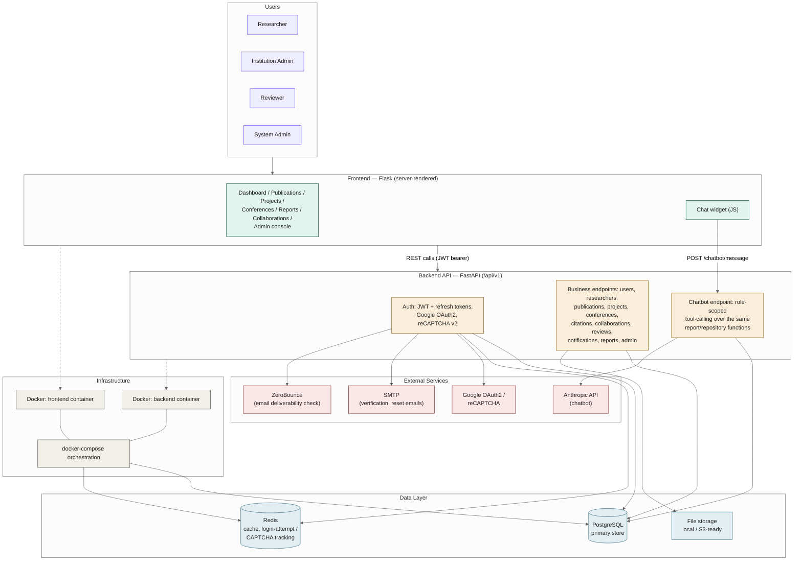

# Scientific Collaboration Network Analyzer (SCNA)

A research collaboration management platform for universities, research institutes, government
laboratories, academic publishers, and funding organizations. It tracks publications, projects,
conferences, citations, and institutional partnerships through a centralized database, and
provides role-specific dashboards, analytics reports, and an AI assistant for navigation and
live-data Q&A.

## Table of Contents

- [Tech Stack](#tech-stack)
- [Architecture](#architecture)
- [Entity-Relationship Diagram](#entity-relationship-diagram)
- [Roles & Access](#roles--access)
- [Features by Module](#features-by-module)
- [Project Structure](#project-structure)
- [Getting Started](#getting-started)
- [Environment Variables](#environment-variables)
- [Running Tests](#running-tests)
- [API Documentation](#api-documentation)

## Tech Stack

| Layer | Technology |
|---|---|
| Backend | Python, FastAPI, Uvicorn |
| Frontend | Flask (server-rendered HTML) |
| Database | PostgreSQL (primary store), Redis (cache / login-attempt tracking) |
| ORM / Migrations | SQLAlchemy, Alembic |
| Validation | Pydantic |
| Authentication | JWT (access + refresh), Google OAuth2, Google reCAPTCHA v2 |
| AI Assistant | Anthropic API (tool-calling chatbot) |
| File Storage | Local filesystem (S3-ready via a pluggable storage backend) |
| Deployment | Docker, docker-compose |
| Testing | pytest |

## Architecture



*(Source: [`docs/architecture/architecture_diagram.mermaid`](docs/architecture/architecture_diagram.mermaid))*

The Flask frontend never talks to the database directly — every read or write goes through the
FastAPI backend's versioned REST API (`/api/v1`), authenticated with a JWT bearer token stored in
the Flask session. The backend is the single source of truth for authorization: each of the four
roles (Researcher, Institution Admin, Reviewer, System Admin) gets a different set of reports,
menu items, and permitted actions, enforced on the API side, not just hidden in the UI.

The AI chatbot reuses the exact same repository functions that power the Reports module, so it
never has its own copy of business logic to drift out of sync — it's a conversational layer over
data the platform already computes deterministically, not a separate analytics engine.

## Entity-Relationship Diagram

```mermaid
%%{init: {'theme': 'neutral'} }%%
erDiagram

    %% ───────────────────────── Identity & Institutions ─────────────────────────
    INSTITUTION ||--o{ USER : employs
    INSTITUTION ||--o{ DEPARTMENT : has
    INSTITUTION ||--o{ INSTITUTION_REQUEST : "originates (optional)"
    USER ||--o{ INSTITUTION_REQUEST : submits
    USER ||--o| RESEARCHER_PROFILE : "has one (researcher / reviewer)"
    DEPARTMENT ||--o{ RESEARCHER_PROFILE : contains

    INSTITUTION {
        int institution_id PK
        string name
        string type
        string country
        string email_domain
    }
    DEPARTMENT {
        int department_id PK
        int institution_id FK
        string name
        string code
    }
    INSTITUTION_REQUEST {
        int request_id PK
        string institution_name
        string domain
        string status
        int requested_by_user_id FK
    }
    USER {
        int user_id PK
        string email
        string password_hash
        string role
        int institution_id FK
        bool is_active
        bool is_email_verified
        string affiliation_status
        string auth_provider
        datetime created_at
    }
    RESEARCHER_PROFILE {
        int researcher_id PK
        int user_id FK
        int department_id FK
        string first_name
        string last_name
        string academic_title
        string orcid_id
        text bio
    }

    %% ───────────────────────── Skills & Interests ─────────────────────────
    RESEARCHER_PROFILE ||--o{ RESEARCHER_SKILL : lists
    SKILL ||--o{ RESEARCHER_SKILL : "tagged via"
    RESEARCHER_PROFILE ||--o{ RESEARCHER_INTEREST : lists
    RESEARCH_INTEREST ||--o{ RESEARCHER_INTEREST : "tagged via"

    SKILL {
        int skill_id PK
        string name
    }
    RESEARCHER_SKILL {
        int researcher_skill_id PK
        int researcher_id FK
        int skill_id FK
    }
    RESEARCH_INTEREST {
        int interest_id PK
        string name
    }
    RESEARCHER_INTEREST {
        int researcher_interest_id PK
        int researcher_id FK
        int interest_id FK
    }

    %% ───────────────────────── Publications & Citations ─────────────────────────
    RESEARCHER_PROFILE ||--o{ PUBLICATION : "is primary author of"
    INSTITUTION ||--o{ PUBLICATION : "affiliated (optional)"
    PUBLICATION ||--o{ PUBLICATION_AUTHOR : "co-authored via"
    RESEARCHER_PROFILE ||--o{ PUBLICATION_AUTHOR : co_authors
    PUBLICATION ||--o{ CITATION : "cited by (internal)"
    RESEARCHER_PROFILE ||--o{ CITATION : adds

    PUBLICATION {
        int publication_id PK
        string title
        string publication_type
        string status
        int primary_author_id FK
        int institution_id FK
        string venue_name
        string doi
        date publication_date
        string file_path
    }
    PUBLICATION_AUTHOR {
        int publication_author_id PK
        int publication_id FK
        int researcher_id FK
        int author_order
    }
    CITATION {
        int citation_id PK
        int citing_publication_id FK
        int cited_publication_id FK
        string external_title
        string external_doi
        int added_by_id FK
    }

    %% ───────────────────────── Projects ─────────────────────────
    RESEARCHER_PROFILE ||--o{ PROJECT : leads
    INSTITUTION ||--o{ PROJECT : "affiliated (optional)"
    PROJECT ||--o{ PROJECT_MEMBER : has
    RESEARCHER_PROFILE ||--o{ PROJECT_MEMBER : "is member via"
    PROJECT ||--o{ PROJECT_MESSAGE : has
    RESEARCHER_PROFILE ||--o{ PROJECT_MESSAGE : sends

    PROJECT {
        int project_id PK
        string title
        text description
        string status
        int lead_researcher_id FK
        int institution_id FK
        date start_date
        date end_date
    }
    PROJECT_MEMBER {
        int project_member_id PK
        int project_id FK
        int researcher_id FK
        string role
        string status
        int invited_by_id FK
    }
    PROJECT_MESSAGE {
        int project_message_id PK
        int project_id FK
        int sender_id FK
        text body
        datetime created_at
    }

    %% ───────────────────────── Conferences ─────────────────────────
    INSTITUTION ||--o{ CONFERENCE : "organizes (optional)"
    CONFERENCE ||--o{ CONFERENCE_PARTICIPATION : hosts
    RESEARCHER_PROFILE ||--o{ CONFERENCE_PARTICIPATION : "participates via"
    PUBLICATION ||--o| CONFERENCE_PARTICIPATION : "linked to (optional)"

    CONFERENCE {
        int conference_id PK
        string name
        date start_date
        date end_date
        string location
        int organizing_institution_id FK
        string status
    }
    CONFERENCE_PARTICIPATION {
        int participation_id PK
        int conference_id FK
        int researcher_id FK
        string role
        string submission_status
        int publication_id FK
    }

    %% ───────────────────────── Collaboration Network & Messaging ─────────────────────────
    RESEARCHER_PROFILE ||--o{ COLLABORATION_REQUEST : "sends / receives"
    RESEARCHER_PROFILE ||--o{ COLLABORATION : "is party to"
    COLLABORATION ||--o{ COLLABORATION_PUBLICATION : "evidenced by"
    PUBLICATION ||--o{ COLLABORATION_PUBLICATION : supports
    COLLABORATION ||--o{ MESSAGE : contains
    RESEARCHER_PROFILE ||--o{ MESSAGE : sends

    COLLABORATION_REQUEST {
        int collaboration_request_id PK
        int requester_id FK
        int addressee_id FK
        string status
        text message
    }
    COLLABORATION {
        int collaboration_id PK
        int researcher1_id FK
        int researcher2_id FK
        int strength
        date first_collaboration
        date last_collaboration
    }
    COLLABORATION_PUBLICATION {
        int collaboration_publication_id PK
        int collaboration_id FK
        int publication_id FK
    }
    MESSAGE {
        int message_id PK
        int collaboration_id FK
        int sender_id FK
        text body
        bool is_read
    }

    %% ───────────────────────── Reviews, Notifications, Admin ─────────────────────────
    USER ||--o{ REVIEW : "is reviewer for"
    USER ||--o{ NOTIFICATION : receives
    USER ||--o{ AUDIT_LOG : generates
    USER ||--o{ SYSTEM_SETTING : updates

    REVIEW {
        int review_id PK
        string target_type
        int target_id
        int reviewer_id FK
        string status
        int score
        string recommendation
    }
    NOTIFICATION {
        int notification_id PK
        int user_id FK
        string notif_type
        string title
        bool is_read
    }
    AUDIT_LOG {
        int audit_id PK
        int user_id FK
        string action
        string entity_type
        int entity_id
    }
    SYSTEM_SETTING {
        int setting_id PK
        string key
        text value
        int updated_by FK
    }
```



*(Source: [`docs/architecture/er_diagram.mermaid`](docs/architecture/er_diagram.mermaid))*

Notes on a couple of intentional design choices visible in the diagram:

- **`REVIEW.target_type` / `target_id`** is a polymorphic reference (points at either a
  `PUBLICATION` or a `CONFERENCE_PARTICIPATION`) rather than two nullable foreign keys, so it has
  no FK arrow of its own in the diagram — same pattern `AUDIT_LOG.entity_type` / `entity_id` uses.
- **`COLLABORATION`** is a durable, established connection created the moment a
  `COLLABORATION_REQUEST` is accepted; `strength` / `first_collaboration` / `last_collaboration`
  are denormalized metrics kept in sync from shared publications rather than computed on every
  read.
- **`MESSAGE`** is always scoped to a `COLLABORATION` — there's no way to message a researcher you
  don't already have an established collaboration with, and no separate "conversation" entity
  since a collaboration already uniquely identifies the pair.

## Roles & Access

Four roles, each with a different dashboard, navigation, and set of reports:

| Role | Can generally do | Reports visible |
|---|---|---|
| **Researcher** | Manage own profile/publications/projects, join conferences, build collaboration network | Researcher, Publications, Projects, Conferences, Collaborations |
| **Reviewer** | Everything a Researcher can, plus review assignments | Researcher (own activity), Reviews (own assignments) |
| **Institution Admin** | Manage their institution's researchers/publications/projects/conferences | Institution (own institution only), Publications, Projects, Conferences |
| **System Admin** | Manage all users, institutions, and platform settings | All reports — System-wide stats, any institution's Institution report, and a system-wide Reviews view across every reviewer |

## Features by Module

1. **User Management** — login, registration with email verification, password reset, Google
   OAuth2 sign-in, reCAPTCHA-gated brute-force protection.
2. **Researcher Management** — academic profile, department, skills, research interests,
   institution affiliation with an approval workflow.
3. **Publication Management** — journal papers, conference papers, books, patents, technical
   reports; Draft → Submitted → Under Review → Accepted → Published → Archived status workflow;
   file upload/download.
4. **Collaboration Management** — co-author network, connection requests, collaboration timeline,
   suggested collaborators, private messaging scoped to an established collaboration.
5. **Project Management** — creation, member invitations (pending/accepted/declined), status
   tracking, project group messaging.
6. **Conference Management** — registration, participation roles (attendee / presenter /
   organizer / reviewer), submission status, event scheduling.
7. **Citation & Reference** — internal citation links between publications, external citation
   records, DOI linking, citation-text generation.
8. **Reviews** — review assignment, accept/decline, score/comments/recommendation submission.
9. **Reports & Export** — 8 report types (Researcher, Publications, Projects, Conferences,
   Collaborations, Reviews, Institution, System), each role-scoped, with Excel and PDF export.
10. **Dashboards** — role-specific home pages with recent activity and key metrics.
11. **Notifications** — in-app notifications for affiliation approvals, review assignments,
    collaboration requests.
12. **Audit & Compliance** — activity logs, publication history, project logs, security logs.
13. **AI Assistant** — in-app chatbot for FAQ/navigation help and read-only live-data Q&A, scoped
    to the signed-in user's own role and data.

## Project Structure

```
scientific-collab-analyzer/
├── backend/                      FastAPI service
│   ├── app/
│   │   ├── api/v1/endpoints/     One module per resource (auth, publications, reports, chatbot, …)
│   │   ├── core/                 Config, security, dependencies, Redis client, reCAPTCHA, chatbot logic
│   │   ├── db/                   Session setup + Alembic migrations
│   │   ├── models/                SQLAlchemy models (see ER diagram above)
│   │   ├── repositories/         Query layer — one file per aggregate, reused by both endpoints and the chatbot
│   │   ├── schemas/               Pydantic request/response models
│   │   ├── services/              Business logic (chatbot, email deliverability, users, researchers)
│   │   └── utils/
│   ├── tests/                     pytest suite (auth, reports, chatbot, …)
│   └── Dockerfile
├── frontend/                      Flask web client
│   ├── templates/                 Jinja2 templates, incl. templates/reports/
│   ├── static/                    CSS + JS (incl. the chatbot widget)
│   ├── app.py                     Routes
│   ├── api_client.py              Thin wrapper around the backend REST API
│   └── Dockerfile
├── docs/architecture/             This README's source diagrams
│   ├── er_diagram.mermaid
│   └── architecture_diagram.mermaid
└── docker-compose.yml
```

## Getting Started

### Docker (recommended)

```bash
cp backend/.env.example backend/.env
# edit backend/.env — at minimum set a real JWT_SECRET_KEY

docker compose up --build
```

- Backend API: http://localhost:8000 (interactive docs at http://localhost:8000/docs)
- Frontend: http://localhost:5000

`docker-compose.yml` brings up PostgreSQL, Redis, the FastAPI backend (which runs Alembic
migrations automatically on startup), and the Flask frontend.

### Local, without Docker

**Backend**
```bash
cd backend
python -m venv venv && source venv/bin/activate
pip install -r requirements.txt
cp .env.example .env   # point DATABASE_URL at a local Postgres
alembic upgrade head
uvicorn app.main:app --reload
```

**Frontend** (in a second terminal)
```bash
cd frontend
python -m venv venv && source venv/bin/activate
pip install -r requirements.txt
export BACKEND_API_URL=http://localhost:8000/api/v1
python app.py
```

## Environment Variables

Set in `backend/.env` (copy from `backend/.env.example`):

| Variable | Purpose |
|---|---|
| `DATABASE_URL` | PostgreSQL connection string |
| `REDIS_URL` | Redis connection string |
| `JWT_SECRET_KEY`, `JWT_ALGORITHM`, `ACCESS_TOKEN_EXPIRE_MINUTES`, `REFRESH_TOKEN_EXPIRE_DAYS` | Auth token config |
| `STORAGE_BACKEND`, `LOCAL_STORAGE_PATH` | File upload storage |
| `CORS_ORIGINS` | Allowed frontend origin(s) |
| `RECAPTCHA_SITE_KEY`, `RECAPTCHA_SECRET_KEY` | Login brute-force protection (defaults are Google's public test keys — replace before production) |
| `ANTHROPIC_API_KEY` | Enables the AI chatbot; leave blank to disable it |
| `SMTP_HOST`, `SMTP_PORT`, `SMTP_USERNAME`, `SMTP_PASSWORD`, `SMTP_FROM_EMAIL`, `SMTP_USE_TLS` | Outgoing verification / password-reset email |

## Running Tests

```bash
cd backend
python -m venv venv && source venv/bin/activate  # if not already active
pip install -r requirements.txt
python -m pytest tests/ -v
```

Tests run against an isolated in-memory SQLite database — no live Postgres/Redis needed. External
calls (Google reCAPTCHA, the Anthropic API) are mocked, so the suite makes no real network calls.

## API Documentation

With the backend running, interactive OpenAPI docs are available at `/docs` (Swagger UI) and
`/redoc` (ReDoc).
