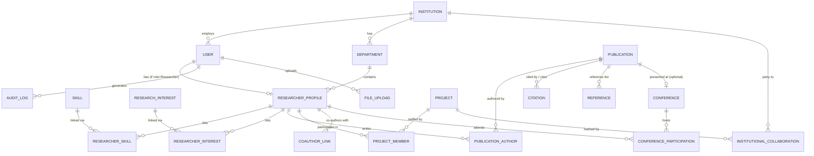

# Scientific Collaboration Network Analyzer — Architecture Phase (Week 1-2)

---

## 1. Project Objective (Explained)

The system is a **centralized research management platform** for universities, research institutes, government labs, and academic publishers. Its purpose is to replace scattered spreadsheets, email threads, and disconnected tools with one database-backed system that tracks:

- **Who** the researchers are (profiles, skills, affiliations, departments)
- **What** they produce (publications: papers, books, patents, reports)
- **How** they work together (co-authorship, projects, institutional collaborations)
- **Where** they present (conferences, presentations)
- **How work is validated** (citations, DOIs, references)
- **How institutions and admins monitor** all of the above (dashboards, reports, audit trails)

Critically, this is a **data management and visualization platform, not an AI/ML analytics tool**. Any "network" or "collaboration" insight comes from relational queries and graph-style joins in the database — not from machine learning. This shapes the whole architecture: it must be built for structured data integrity, traceability, and reporting rather than for prediction or inference.

---

## 2. Business Requirements

| # | Requirement | Description |
|---|---|---|
| BR1 | Centralized researcher registry | Single source of truth for researcher identity, affiliation, and expertise |
| BR2 | Publication lifecycle management | Track publications from draft to archived, with metadata and files |
| BR3 | Collaboration tracking | Record co-authorship and cross-institution partnerships |
| BR4 | Project & funding tracking | Track funded projects, budgets, timelines, and staffing |
| BR5 | Conference participation tracking | Record registrations, presentations, and attendance history |
| BR6 | Citation & reference management | Link publications to citations and DOIs for impact tracking |
| BR7 | Institutional reporting | Give institution admins visibility into departmental output |
| BR8 | Role-based access control | Different capabilities for Researchers, Institution Admins, Reviewers, System Admins |
| BR9 | Auditability & compliance | Every significant action must be logged for security/compliance |
| BR10 | Exportable reports | Publication/collaboration/institution reports in PDF/Excel |
| BR11 | Scalable deployment | Must run containerized (Docker) for portability across institutions |

---

## 3. Actors

| Actor | Description | Primary Interactions |
|---|---|---|
| **Researcher** | Individual academic/scientist | Manages own profile, submits publications, joins projects, registers for conferences |
| **Institution Admin** | Represents a university/org | Manages department & researcher records for their institution, views institutional reports |
| **Reviewer** | Reviews submitted publications/projects | Approves/rejects publication status changes, adds review comments |
| **System Admin** | Platform-level operator | Manages all users, institutions, system configuration, and audit logs |
| **External System (via API)** | CrossRef/DOI, ORCID, file storage | Machine-to-machine integration, not a human actor, but a system boundary |

---

## 4. Functional Requirements

**User Management**
- FR1: Users can register and log in via JWT-based authentication
- FR2: System supports role assignment (Researcher, Institution Admin, Reviewer, System Admin)
- FR3: Institution Admins can manage their institution's profile and departments

**Researcher Management**
- FR4: Researchers can create/update academic profiles (skills, interests, affiliations)
- FR5: System supports searching/filtering researchers by department, skill, or interest

**Publication Management**
- FR6: Researchers can upload publications with metadata (type, status, DOI, file)
- FR7: Publication status follows a defined lifecycle: Draft → Submitted → Published → Archived
- FR8: Multiple authors can be linked to one publication with author order and corresponding-author flag

**Collaboration Management**
- FR9: System automatically derives co-author links from shared publications
- FR10: Users can create/manage research projects and assign team members
- FR11: Institutional collaborations can be recorded against a project

**Conference Management**
- FR12: Researchers can register for conferences and log presentations
- FR13: System tracks participation history per researcher

**Citation & Reference Management**
- FR14: Publications can cite other publications (internal or external via DOI)
- FR15: Reference lists can be attached to a publication

**Dashboards & Reports**
- FR16: Researcher/Institution/Admin dashboards show role-relevant summaries
- FR17: Reports can be exported to PDF and Excel

**Audit**
- FR18: All create/update/delete actions on key entities are logged with actor, timestamp, and details

---

## 5. Non-Functional Requirements

| Category | Requirement |
|---|---|
| **Performance** | API responses < 300ms for standard CRUD; report generation < 5s for typical datasets |
| **Scalability** | Support concurrent use by multiple institutions; horizontally scalable API layer |
| **Security** | JWT + OAuth2 authentication, HTTPS/TLS everywhere, hashed passwords (bcrypt/argon2) |
| **Availability** | Target 99.5% uptime; backup & disaster recovery via scheduled DB backups |
| **Maintainability** | Modular FastAPI structure, migrations via Alembic, documented API (OpenAPI/Swagger) |
| **Auditability** | Immutable audit logs for compliance reporting |
| **Portability** | Fully containerized via Docker; environment-based configuration |
| **Data Integrity** | Enforced foreign keys, normalized schema (3NF), transactional writes |
| **Usability** | Consistent role-based UI, clear publication status indicators |
| **Compliance** | Support export of user data and activity logs for institutional audits |

---

## 6. Database Schema Design

### Core Tables

**institution**
- institution_id (PK)
- name, type, country, address
- created_at

**department**
- department_id (PK)
- institution_id (FK → institution)
- name, code

**user**
- user_id (PK)
- email (unique), password_hash
- role (enum: researcher, institution_admin, reviewer, system_admin)
- institution_id (FK → institution, nullable for system_admin)
- status (active/inactive), created_at, updated_at

**researcher_profile**
- researcher_id (PK)
- user_id (FK → user, unique — 1:1)
- department_id (FK → department)
- first_name, last_name, academic_title, orcid_id, bio
- created_at

**skill** / **researcher_skill** (join table)
**research_interest** / **researcher_interest** (join table)

### Publication Domain

**publication**
- publication_id (PK)
- title, type (journal/conference/book/patent/report), status (draft/submitted/published/archived)
- abstract, publication_date, doi, file_path
- submitted_by (FK → user)
- created_at, updated_at

**publication_author** (join table, resolves many-to-many between publication and researcher_profile)
- publication_author_id (PK)
- publication_id (FK), researcher_id (FK)
- author_order, is_corresponding_author

**citation**
- citation_id (PK)
- citing_publication_id (FK → publication)
- cited_publication_id (FK → publication, nullable if external)
- citation_context, created_at

**reference**
- reference_id (PK)
- publication_id (FK)
- reference_text, external_doi

### Collaboration & Project Domain

**project**
- project_id (PK)
- title, description, funding_source, budget
- start_date, end_date, status
- lead_researcher_id (FK → researcher_profile)

**project_member** (join table)
- project_member_id (PK)
- project_id (FK), researcher_id (FK)
- role_in_project, joined_date

**institutional_collaboration**
- collaboration_id (PK)
- project_id (FK), institution_id (FK)
- agreement_type, start_date, end_date

**coauthor_link** (derived/materialized table for fast network queries)
- coauthor_link_id (PK)
- researcher_id_a (FK), researcher_id_b (FK), publication_id (FK)
- collaboration_strength (count or weight)

### Conference Domain

**conference**
- conference_id (PK)
- name, location, start_date, end_date, website_url

**conference_participation** (join table)
- participation_id (PK)
- conference_id (FK), researcher_id (FK)
- role, presentation_title, registered_at

### Cross-Cutting

**audit_log**
- audit_id (PK)
- user_id (FK), action, entity_type, entity_id
- details, ip_address, created_at

**file_upload**
- file_id (PK)
- uploaded_by (FK → user), entity_type, entity_id
- file_name, storage_path, mime_type, uploaded_at

---

## 7. Normalization

The schema above is designed to satisfy **Third Normal Form (3NF)**:

- **1NF**: Every table has atomic columns (e.g., skills and interests are separated into their own tables/join tables rather than stored as comma-separated strings on `researcher_profile`).
- **2NF**: All non-key attributes depend on the *whole* primary key. Join tables like `publication_author` and `project_member` exist specifically so that composite relationships (many-to-many) don't force partial dependencies onto a single table.
- **3NF**: No transitive dependencies. For example, `department` is a separate table from `institution` rather than embedding institution name/address directly on `researcher_profile` — if it were embedded, updating an institution's address would require updating every researcher's row (a transitive dependency).

**Deliberate denormalization**: `coauthor_link` is a materialized/derived table. Strictly speaking, co-authorship could always be computed on-the-fly by joining `publication_author` to itself. We denormalize it slightly for query performance on collaboration-network views, since this is a read-heavy analytical need. This is a common, intentional trade-off and is documented for that reason — it's the one exception to strict normalization in this schema.

---

## 8. ER Diagram (Mermaid)



*(A full field-level version of this diagram, including every column, is saved separately as `er_diagram.mermaid` for closer inspection.)*

---

## 9. Relationship Explanations

- **Institution → User (1:N)**: An institution employs many users; a user belongs to exactly one institution (system admins may have none).
- **Institution → Department (1:N)**: Institutions are subdivided into departments for reporting and profile grouping.
- **User → Researcher_Profile (1:1, optional)**: Only users with the `researcher` role get a researcher profile. This separation keeps authentication/authorization concerns (in `user`) distinct from academic-identity concerns (in `researcher_profile`) — a classic identity-vs-profile split.
- **Department → Researcher_Profile (1:N)**: Each researcher sits in one department; a department has many researchers.
- **Researcher_Profile ↔ Skill / Research_Interest (M:N via join tables)**: A researcher can have many skills/interests, and each skill/interest can belong to many researchers — hence the join tables `researcher_skill` and `researcher_interest`.
- **Publication ↔ Researcher_Profile (M:N via publication_author)**: A publication can have multiple authors, and a researcher can author multiple publications. The join table also carries relationship-specific attributes (`author_order`, `is_corresponding_author`) that don't belong to either parent table.
- **Publication → Citation (1:N, self-referencing via two FKs)**: A publication can cite many others and be cited by many others. Two foreign keys (`citing_publication_id`, `cited_publication_id`) both point back to `publication`, forming a self-referencing many-to-many relationship.
- **Publication → Reference (1:N)**: A publication's reference list is a simple one-to-many; references may point to external (non-system) works via `external_doi`.
- **Project → Researcher_Profile (M:N via project_member)**: Projects have many staff members; researchers can be on many projects. `role_in_project` captures each person's function (PI, co-investigator, research assistant, etc.).
- **Project → Institution (M:N via institutional_collaboration)**: A project can involve multiple institutions (multi-institution grants); an institution can be involved in many projects.
- **Researcher_Profile ↔ Researcher_Profile (M:N via coauthor_link)**: A self-referencing many-to-many that captures the "collaboration network" directly — this is what powers network visualizations without needing AI/graph-ML, just SQL joins/aggregations.
- **Conference → Researcher_Profile (M:N via conference_participation)**: Researchers attend many conferences; conferences have many attendees. Presentation title and role are relationship attributes.
- **Publication → Conference (N:1, optional)**: A conference paper may optionally be linked to the conference where it was presented.
- **User → Audit_Log (1:N)**: Every logged action is attributed to the user who performed it, satisfying the audit/compliance requirement.
- **User → File_Upload (1:N)**: Tracks who uploaded which file, linked generically to any entity type (`entity_type` + `entity_id`) so the same table can service publication files, profile photos, etc.

---

## 10. REST API Design — User & Researcher Modules

### User Module

| Method | Endpoint | Description | Auth |
|---|---|---|---|
| POST | `/api/v1/auth/register` | Register new user (email, password, role, institution_id) | Public |
| POST | `/api/v1/auth/login` | Authenticate, return JWT access + refresh token | Public |
| POST | `/api/v1/auth/refresh` | Refresh access token | Refresh token |
| POST | `/api/v1/auth/logout` | Invalidate refresh token | Authenticated |
| GET | `/api/v1/users/me` | Get current user's account details | Authenticated |
| PATCH | `/api/v1/users/me` | Update own account (email, password) | Authenticated |
| GET | `/api/v1/users` | List all users (filter by institution/role) | Institution Admin, System Admin |
| GET | `/api/v1/users/{user_id}` | Get a specific user | System Admin, Institution Admin (own institution) |
| PATCH | `/api/v1/users/{user_id}` | Update role/status of a user | System Admin |
| DELETE | `/api/v1/users/{user_id}` | Deactivate a user (soft delete) | System Admin |
| GET | `/api/v1/institutions` | List institutions | Authenticated |
| POST | `/api/v1/institutions` | Create institution | System Admin |
| GET | `/api/v1/institutions/{id}` | Get institution details | Authenticated |
| PATCH | `/api/v1/institutions/{id}` | Update institution | Institution Admin (own), System Admin |
| GET | `/api/v1/institutions/{id}/departments` | List departments for an institution | Authenticated |
| POST | `/api/v1/institutions/{id}/departments` | Create department | Institution Admin, System Admin |

### Researcher Module

| Method | Endpoint | Description | Auth |
|---|---|---|---|
| POST | `/api/v1/researchers` | Create researcher profile for current user | Authenticated (role=researcher) |
| GET | `/api/v1/researchers/me` | Get own researcher profile | Authenticated |
| PATCH | `/api/v1/researchers/me` | Update own profile (title, bio, department, ORCID) | Authenticated |
| GET | `/api/v1/researchers` | Search/list researchers (filter: department, skill, interest, institution) | Authenticated |
| GET | `/api/v1/researchers/{researcher_id}` | Get a specific researcher's public profile | Authenticated |
| GET | `/api/v1/researchers/{researcher_id}/publications` | List a researcher's publications | Authenticated |
| GET | `/api/v1/researchers/{researcher_id}/collaborators` | List co-authors (from coauthor_link) | Authenticated |
| POST | `/api/v1/researchers/me/skills` | Add a skill to own profile | Authenticated |
| DELETE | `/api/v1/researchers/me/skills/{skill_id}` | Remove a skill | Authenticated |
| POST | `/api/v1/researchers/me/interests` | Add a research interest | Authenticated |
| DELETE | `/api/v1/researchers/me/interests/{interest_id}` | Remove a research interest | Authenticated |

**Design notes**
- Versioned under `/api/v1/` to allow safe evolution later.
- `/me` conventions used to avoid leaking user IDs unnecessarily and to keep "my own data" actions consistent.
- Role checks enforced at the dependency-injection layer in FastAPI (e.g. `Depends(require_role(["institution_admin","system_admin"]))`).
- All list endpoints support pagination (`?page=`, `?page_size=`) and filtering query params.
- All mutating endpoints trigger an `audit_log` entry.

---

## 11. Folder Structure

```
scientific-collab-analyzer/
├── backend/
│   ├── app/
│   │   ├── main.py                     # FastAPI app entrypoint
│   │   ├── core/
│   │   │   ├── config.py               # Settings (env vars, pydantic BaseSettings)
│   │   │   ├── security.py             # JWT, password hashing, OAuth2 scheme
│   │   │   └── dependencies.py         # Shared dependencies (auth, role checks, DB session)
│   │   ├── db/
│   │   │   ├── base.py                 # SQLAlchemy Base, metadata
│   │   │   ├── session.py              # Engine + SessionLocal
│   │   │   └── migrations/             # Alembic migrations
│   │   ├── models/
│   │   │   ├── user.py
│   │   │   ├── institution.py
│   │   │   ├── department.py
│   │   │   ├── researcher.py
│   │   │   ├── publication.py
│   │   │   ├── citation.py
│   │   │   ├── project.py
│   │   │   ├── conference.py
│   │   │   ├── audit_log.py
│   │   │   └── file_upload.py
│   │   ├── schemas/                    # Pydantic request/response models
│   │   │   ├── user.py
│   │   │   ├── researcher.py
│   │   │   ├── publication.py
│   │   │   └── ...
│   │   ├── api/
│   │   │   └── v1/
│   │   │       ├── router.py            # Aggregates all module routers
│   │   │       ├── endpoints/
│   │   │       │   ├── auth.py
│   │   │       │   ├── users.py
│   │   │       │   ├── institutions.py
│   │   │       │   ├── researchers.py
│   │   │       │   ├── publications.py
│   │   │       │   ├── collaborations.py
│   │   │       │   ├── conferences.py
│   │   │       │   ├── citations.py
│   │   │       │   ├── reports.py
│   │   │       │   └── audit.py
│   │   ├── services/                   # Business logic layer (separate from routes)
│   │   │   ├── user_service.py
│   │   │   ├── researcher_service.py
│   │   │   ├── publication_service.py
│   │   │   └── ...
│   │   ├── repositories/               # DB access layer (query encapsulation)
│   │   │   ├── user_repository.py
│   │   │   ├── researcher_repository.py
│   │   │   └── ...
│   │   └── utils/
│   │       ├── audit.py                # Helper to write audit_log entries
│   │       └── file_storage.py         # S3/local storage abstraction
│   ├── tests/
│   │   ├── unit/
│   │   └── integration/
│   ├── alembic.ini
│   ├── requirements.txt
│   └── Dockerfile
├── frontend/
│   ├── (Tkinter/PyQt desktop client OR Flask-rendered web client — decision pending)
│   └── ...
├── docker-compose.yml                  # api + postgres + redis services
├── docs/
│   ├── architecture/                   # This document, ER diagrams, API specs
│   └── api/                            # OpenAPI exports
├── .github/
│   └── workflows/                      # GitHub Actions CI/CD
├── .env.example
└── README.md
```

**Rationale**: Separating `models` (ORM/table definitions), `schemas` (API contracts), `services` (business logic), and `repositories` (data access) keeps concerns isolated so that, e.g., publication-status-transition rules live in one place and aren't duplicated across endpoint handlers.

---

## 12. Technology Stack — Why Each Was Chosen

| Technology | Role | Why |
|---|---|---|
| **Python** | Core language | Strong ecosystem for data-heavy backends, readable, matches team/project scope |
| **FastAPI** | Web framework | Async-native, automatic OpenAPI/Swagger docs, Pydantic-based validation — ideal for a JSON API with many structured entities like this one |
| **Uvicorn** | ASGI server | Required to actually run FastAPI's async app; lightweight and production-capable (often paired with Gunicorn workers) |
| **PostgreSQL** | Primary database | Relational integrity (FKs, constraints) is essential here since the whole platform is about interconnected entities (users, publications, projects); strong support for complex joins needed for "collaboration network" queries without needing a graph DB |
| **SQLAlchemy** | ORM | Maps the many relationships (1:1, 1:N, M:N) cleanly into Python objects; supports both ORM and raw-SQL fallback for heavy analytical queries |
| **Alembic** | Migrations | Works natively with SQLAlchemy; needed because the schema will evolve across the 8-week timeline without losing data |
| **Pydantic** | Data validation | Used by FastAPI for request/response schemas; ensures invalid data (e.g., malformed DOI, wrong enum status) is rejected at the API boundary |
| **Redis** | Cache | Speeds up expensive/repeated reads (dashboards, researcher search, collaboration network aggregates) without hitting Postgres every time |
| **JWT + OAuth2** | Authentication | JWT gives stateless, scalable auth (no server-side session store needed); OAuth2 password flow is FastAPI's standard, well-documented pattern and leaves the door open for future SSO/ORCID login |
| **AWS S3 / Local Storage** | File storage | Publications and profile files need durable storage; abstracting behind an interface lets small deployments use local disk and larger/production deployments use S3 without code changes |
| **Docker** | Containerization | Explicit project requirement (deploy using Docker); ensures the app + Postgres + Redis run consistently across dev/staging/production |
| **GitHub + GitHub Actions** | Version control & CI/CD | Automates testing/linting on every push; team already likely familiar with GitHub workflows |
| **Postman** | API testing | Used during development to manually verify endpoints against the OpenAPI spec before frontend integration |
| **Tkinter / PyQt / Flask (frontend — pending decision)** | Client | The tech stack lists three options; this needs to be pinned down explicitly (see open item below) since Tkinter/PyQt imply a desktop app while Flask implies a web app — these are architecturally very different clients |

---

## Open Item Before Implementation

The provided tech stack lists **Tkinter, PyQt, and Flask** all under "Frontend," but these represent two different application types:
- Tkinter/PyQt → **desktop application**
- Flask → **web application** (though note Flask is a backend framework — presumably paired with server-rendered templates or a small JS layer)

Please confirm which client type Week 1 should target, since this affects the folder structure above and how the API is consumed (desktop app calling FastAPI over HTTP vs. Flask serving HTML that itself calls FastAPI vs. Flask acting as a thin proxy).

---

## Next Step

Once you approve or request changes to any of the sections above (schema, ER diagram, APIs, folder structure, or stack rationale), we can move into implementation starting with:
1. Database schema creation (SQLAlchemy models + Alembic initial migration)
2. Authentication (JWT) setup
3. User & Researcher endpoints

No code has been written yet, per your instruction.
