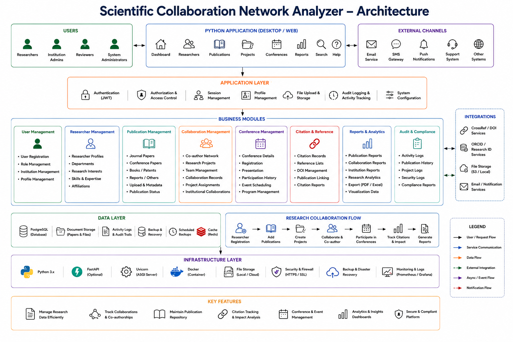

# Scientific Collaboration Network Analyzer (SCNA)
## Project Documentation

**Version:** 1.0
**Backend:** FastAPI (Python 3.12) — port `8000`
**Frontend:** Flask (server-rendered) — port `5000`
**Database:** PostgreSQL (Supabase) via SQLAlchemy 2.0 + Alembic
**Repository:** `Scientific-Collaboration-Network-Analyzer-Group-2`

---

## Table of Contents

1. [Project Overview](#1-project-overview)
2. [Architecture](#2-architecture) — includes [Architecture Diagram](#21-architecture-diagram)
3. [Tech Stack](#3-tech-stack) — includes [Database Schema / ERD](#31-database-schema-erd)
4. [Getting Started](#4-getting-started)
5. [Roles & Role-Based Access Control](#5-roles--role-based-access-control)
6. [Module 1 — User Management (Registration, Login, MFA)](#6-module-1--user-management)
7. [Module 2 — Researcher Profile Management](#7-module-2--researcher-profile-management)
8. [Module 3 — Institution Management](#8-module-3--institution-management)
9. [Module 4 — Publication Management](#9-module-4--publication-management)
10. [Module 5 — Collaboration Management](#10-module-5--collaboration-management)
11. [Module 6 — Project Management](#11-module-6--project-management)
12. [Module 7 — Conference Management](#12-module-7--conference-management)
13. [Module 8 — Citation & Reference Module](#13-module-8--citation--reference-module)
14. [Module 9 — Institutional Collaborations](#14-module-9--institutional-collaborations)
15. [Module 10 — Reviewer Assignments](#15-module-10--reviewer-assignments)
16. [Module 11 — Dashboards](#16-module-11--dashboards)
17. [Module 12 — Reports & Export](#17-module-12--reports--export)
18. [Module 13 — Notifications](#18-module-13--notifications)
19. [Module 14 — Messages](#19-module-14--messages)
20. [Module 15 — Audit Module](#20-module-15--audit-module)
21. [Module 16 — Admin User Management](#21-module-16--admin-user-management)
22. [Full API Endpoint Reference](#22-full-api-endpoint-reference)
23. [Testing Guide](#23-testing-guide)
24. [Known Issues & Troubleshooting](#24-known-issues--troubleshooting)
25. [Future Scope](#25-future-scope)

---

## 1. Project Overview

SCNA is a research collaboration management platform for universities and research
organizations. It centralizes researchers, publications, institutions, projects,
conferences, citations, and collaborations in a single database and provides
dashboards, reports, and network visualizations — without AI-based analysis (v1
scope).

**Target users:** universities, research institutes, government laboratories,
academic publishers, funding organizations.

**Outcomes delivered:**
1. Research management system
2. Publication repository
3. Collaboration network management
4. Conference and project tracking
5. Institutional collaboration workflows
6. Publication analytics
7. Reporting dashboards
8. Docker-based deployment

---

## 2. Architecture




Two-tier web architecture: a Flask server-rendered frontend and a FastAPI backend,
both containerized with Docker and communicating over an internal Docker network
(and directly over HTTP in local dev). The database is a managed PostgreSQL
instance (Supabase).

```
Browser
   │
   ▼
Flask Frontend (port 5000)  ──HTTP (Bearer JWT)──►  FastAPI Backend (port 8000)
   │  session cookie stores JWT + cached role                │
   │  Jinja2 templates render all pages                      ▼
   │                                                   PostgreSQL (Supabase)
   ▼                                                          │
Static assets (CSS)                                    Redis (cache) · Uploads dir
```

**Layers**
- **Presentation** — Flask app: Dashboard, Researchers, Publications, Projects,
  Conferences, Reports, Search.
- **Application layer** — JWT auth, authorization, session management, profile
  management, file upload/storage, audit logging, system configuration.
- **Business modules** — User Management, Researcher Management, Publication
  Management, Collaboration Management, Conference Management, Citation &
  Reference, Reports & Analytics, Audit & Compliance.
- **Data layer** — PostgreSQL (Supabase), file storage, activity/audit logs,
  backups, Redis cache.
- **Infrastructure** — Python 3.x, FastAPI, Uvicorn, Docker, HTTPS/SSL,
  monitoring/logging.

**Integrations:** CrossRef/DOI (planned), ORCID (planned), local/S3 file storage,
SMTP email, Google Sign-In (OAuth2).

**Key design point:** the Flask frontend never talks to the database directly.
Every page load and form submission calls the FastAPI backend over HTTP with the
user's JWT in the `Authorization: Bearer <token>` header, and renders the JSON
response into a template. This means every UI action documented below has a
corresponding backend endpoint — testing the API directly (via `/docs` or
Postman) is equivalent to testing the UI action.

### 2.1 Architecture Diagram


This diagram (from the original project specification) maps directly onto the
implementation: the "Python Application (Desktop/Web)" block is the Flask
frontend, the "Business Modules" row corresponds to the 16 modules documented
in this file (§6–§21), the "Data Layer" is PostgreSQL/Redis/file storage as
described in §3–§4, and "External Channels"/"Integrations" correspond to SMTP
email, Google Sign-In, and the planned CrossRef/ORCID integrations in §25.

---

## 3. Tech Stack

| Layer | Technology |
|---|---|
| Backend framework | Python 3.12, FastAPI, Uvicorn (ASGI) |
| Frontend | Flask (server-rendered Jinja2 templates) |
| Database | PostgreSQL (Supabase) |
| Cache | Redis |
| ORM / Migrations | SQLAlchemy 2.0, Alembic |
| Validation | Pydantic v2, pydantic-settings |
| Auth | JWT (python-jose), OAuth2 password flow, Google Sign-In, MFA via email OTP |
| Password hashing | passlib[bcrypt] |
| Exports | openpyxl (Excel), reportlab (PDF) |
| DB driver | psycopg[binary] (psycopg v3) |
| DevOps | Docker, Docker Compose, GitHub Actions, Postman |
| Testing | pytest, httpx, ruff (lint) |

### 3.1 Database Schema (ERD)


This is the live schema as provisioned in Supabase (PostgreSQL), reverse-engineered
from the running database — it reflects the actual tables/columns created by the
Alembic migrations in `backend/alembic/versions/`, not just the Milestone-1 design
in `SCHEMA.md`. Key relationships visible in the diagram:

- **`users` → `researchers`** (1:1 via `researchers.user_id`) — every login
  account of role `researcher`/`institution_admin`/`reviewer`/`system_admin` may
  have exactly one researcher profile.
- **`institutions` → `researchers`** (1:N via `researchers.institution_id`).
- **`institutions` → `institution_collaborations`** (M:N via
  `institution1_id`/`institution2_id`) — see §14.
- **`researchers` → `collaborations` / `collaboration_requests`** — see §10.
- **`conferences` → `conference_sessions`** and **`conferences` →
  `conference_attendances`** (participations) — see §12.
- **`collaborations` → `collaboration_publications`** — links a collaboration to
  the publications produced under it.
- **`project_members`** — join table between `researchers` and `projects` with
  its own `projectmemberrole`/`projectmemberstatus` enums — see §11.
- **`users` → `auth_tokens`** — verification/reset/OTP tokens (§6).
- **`users` → `audit_logs`** (via `actor_user_id`) — see §20.

---

## 4. Getting Started

### 4.1 Prerequisites
- Python 3.12
- PostgreSQL access (Supabase connection string) or local Postgres
- Docker & Docker Compose (for containerized run)

### 4.2 Running locally without Docker

**Terminal 1 — Backend**
```bash
cd backend
source venv/bin/activate          # Windows: venv\Scripts\activate
pip install -r requirements.txt
alembic upgrade head
uvicorn app.main:app --reload --port 8000
```
- Health check: `http://127.0.0.1:8000/health`
- Interactive API docs (Swagger UI): `http://127.0.0.1:8000/docs`

**Terminal 2 — Frontend**
```bash
cd frontend
source venv/bin/activate          # Windows: venv\Scripts\activate
pip install -r requirements.txt
python app.py
```
- App: `http://127.0.0.1:5000`

**Required `.env` values**

| File | Required keys |
|---|---|
| `backend/.env` | `DATABASE_URL`, `JWT_SECRET_KEY`, `SMTP_USERNAME`, `SMTP_PASSWORD`, `SMTP_FROM_EMAIL`, `SMTP_FROM_NAME`, `GOOGLE_CLIENT_ID`, `FRONTEND_URL` |
| `frontend/.env` | `BACKEND_URL`, `FLASK_SECRET_KEY`, `GOOGLE_CLIENT_ID` (must match backend), `RECAPTCHA_SITE_KEY`, `RECAPTCHA_SECRET_KEY` |

If `SMTP_USERNAME`/`SMTP_PASSWORD` are blank, emails (verification, OTP, password
reset) print to the backend console instead of failing — useful for local testing.

Always run `alembic upgrade head` after pulling new commits, before starting the
backend — schema drift is the most common local startup failure.

### 4.3 Running with Docker
```bash
cd Scientific-Collaboration-Network-Analyzer-Group-2
# create backend/.env and frontend/.env from the .env.example files first
docker compose build
docker compose up -d
docker compose ps            # both services should show "healthy"
docker compose logs -f backend
```

| Service | URL | Health check |
|---|---|---|
| Backend (FastAPI) | http://localhost:8000 | `GET /health` |
| Frontend (Flask) | http://localhost:5000 | `GET /login` |

**Migrations inside Docker:**
```bash
alembic upgrade head    # apply all pending migrations
alembic current          # show current revision
```

---

## 5. Roles & Role-Based Access Control

The platform has **four roles**, stored on `users.role`:

| Role | Value | Typical user |
|---|---|---|
| Researcher | `researcher` | Default role for anyone who signs up |
| Institution Admin | `institution_admin` | Manages one institution's profile, its conferences, and its institutional collaborations |
| Reviewer | `reviewer` | Reviews submitted publications assigned to them |
| System Admin | `system_admin` | Full platform control — superuser |

### How RBAC is enforced

- Every backend endpoint that changes data (or reads sensitive data) depends on
  `get_current_user` (any logged-in user) or `require_role(...)` (only specific
  roles).
- `require_role()` **always** lets `system_admin` through, in addition to any
  roles explicitly listed — so System Admin can do everything every other role
  can do, plus admin-only actions.
- The **frontend never trusts the browser** for authorization — every
  Flask route that appears role-gated (e.g. "only Institution Admins see the
  Institution Collaborations status buttons") is a UI convenience. The
  authoritative check happens again on the FastAPI backend; if a user forges a
  request, the backend returns `403 Forbidden`.

### Role capability matrix

> **Policy update:** Institution Admin, Reviewer, and System Admin are
> **management/oversight roles**, not research-participant roles. They do not
> author publications, attend conferences as participants, or take part in
> the peer collaboration/project network. Only **Researcher** accounts do
> the hands-on research activity; the other three roles administer,
> organize, review, or audit the platform around that activity.

| Capability | Researcher | Institution Admin | Reviewer | System Admin |
|---|:---:|:---:|:---:|:---:|
| Register / log in / manage own profile | ✅ | ✅ | ✅ | ✅ |
| Create/edit own publications | ✅ | ❌ | ❌ | ❌ |
| Review publications assigned to them | — | — | ✅ | ✅ |
| Create/edit conferences (organize) | — | ✅ (own institution) | — | ✅ |
| Register for / attend conferences | ✅ | ❌ | ❌ | ❌ |
| Send/accept collaboration requests | ✅ | ❌ | ❌ | ❌ |
| Join / be invited to projects | ✅ | ❌ | ❌ | ❌ |
| Create institutions | — | — | — | ✅ |
| Edit/delete institutions | — | ✅ (own, via edit page) | — | ✅ |
| Propose/approve institutional collaborations | — | ✅ | — | ✅ |
| View/download compliance reports | — | — | — | ✅ |
| Manage all users & roles | — | — | — | ✅ |
| Assign reviewers to publications | — | — | — | ✅ |
| View audit logs | — | — | — | ✅ |

**In plain terms:**
- **Researcher** — the only role that authors publications, attends/presents
  at conferences, sends or accepts collaboration requests, and joins
  projects.
- **Institution Admin** — manages their institution's profile, organizes
  that institution's conferences, and proposes/manages institutional
  (institution-to-institution) collaborations. Does **not** author
  publications, attend conferences as a participant, or take part in
  researcher-to-researcher collaborations or projects.
- **Reviewer** — reviews publications assigned to them. Does **not** author
  publications, join projects, or send/accept collaboration requests.
- **System Admin** — full oversight: manages users/roles, institutions,
  reviewer assignments, audit logs, and compliance reports. Like Institution
  Admin and Reviewer, does **not** author publications, attend conferences
  as a participant, or take part in researcher collaborations or projects.

> **Implementation note:** the capability restrictions above reflect the
> intended platform policy. Enforcement in the current codebase is via
> `require_role()` on admin/organizer-only endpoints (see §22); several of
> the "author/attend/collaborate" endpoints (`POST /publications`, `POST
> /conferences/{id}/participations`, `POST
> /collaborations/collaboration-requests`, `POST /projects/{id}/members`)
> are currently open to **any authenticated role** at the API level. Until
> these are updated to reject non-Researcher roles server-side, treat the
> matrix above as the **target behavior to test against** — see the
> "What to test" callouts in §9–§11 for the specific negative cases to
> verify (and file as defects if a restricted role is still able to
> perform the action).

---

## 6. Module 1 — User Management

Covers registration, login, email verification, MFA (email OTP), Google Sign-In,
and password reset.

**Backend routes:** `/auth/*` (`backend/app/api/routes/auth.py`)
**Frontend pages:** `/register`, `/login`, `/mfa/verify`, `/forgot-password`,
`/reset-password`, `/verify-email`

### 6.1 How to register (new account)

1. Go to `http://127.0.0.1:5000/register`.
2. Fill in:
   - **Email** — must be unique.
   - **Password**.
   - **Role** — choose *Researcher* or *Institution Admin* (Reviewer and
     System Admin accounts cannot self-register from the public form; they
     are created/promoted by a System Admin — see §21).
   - If **Institution Admin** is selected, additional institution fields
     appear (institution name, etc.) — the request goes to `POST /auth/register`
     and internally creates an **institution-admin application** that a
     System Admin must approve (a notification is sent to all System Admins).
3. Submit. On success you'll be asked to verify your email (`POST
   /auth/verify-email` — check the backend console log if SMTP isn't
   configured, the verification link/code is printed there).
4. Once verified, log in.

**What to test:**
- Registering with an already-used email → should be rejected with a clear error.
- Registering as Institution Admin → confirm a System Admin receives a
  notification/application to approve.
- Weak/short passwords → should be rejected by validation.

### 6.2 How to log in

1. Go to `/login`, enter email + password.
2. Backend: `POST /auth/login` (OAuth2 password flow) → returns a JWT
   `access_token` on success.
3. If the account has **MFA enabled**, login instead returns a `pre_auth_token`
   and the frontend redirects to `/mfa/verify`, where you enter the one-time
   code emailed to you (`POST /auth/mfa/verify-login`). Use `/mfa/resend` (`POST
   /auth/mfa/resend-otp`) if the code doesn't arrive.
4. After repeated failed logins, the login page shows a reCAPTCHA challenge
   (frontend-enforced, configured via `RECAPTCHA_SITE_KEY`).
5. On success, the frontend stores the JWT in the server-side session and
   redirects: **System Admin / Institution Admin → `/dashboard`** (admin
   view), everyone else → their role's dashboard.

**What to test:**
- Correct credentials → redirected to the right dashboard for the role.
- Wrong password → error shown, no token issued.
- Account with MFA enabled → redirected to OTP screen; wrong code rejected;
  correct code logs in.
- Inactive/deactivated account (see §21) → login blocked.

### 6.3 Enable / disable MFA

- Page: `/security` (Security Settings).
- Enable: `POST /auth/mfa/enable` (must be logged in). Next login will require
  an emailed OTP.
- Disable: `POST /auth/mfa/disable` — Institution Admins/System Admins can
  disable MFA for their own account from this page as well.

### 6.4 Forgot / reset password

1. `/forgot-password` → enter email → `POST /auth/forgot-password` (emails a
   reset link/token, or prints it to console if SMTP isn't configured).
2. Open the link → `/reset-password?token=...` → enter new password →
   `POST /auth/reset-password`.

### 6.5 Google Sign-In

- `/login` and `/register` both offer "Sign in with Google".
- Frontend posts the Google credential to `POST /auth/google`
  (`app.py: /auth/google`), backend verifies the token, creates or matches a
  user by `google_sub`, and issues the same JWT flow. If it's a brand-new
  Google account, the response may include `needs_role_selection: true`,
  prompting the user to pick Researcher or Institution Admin before
  finishing.

### 6.6 Role-based access for this module
All registration/login/MFA/password endpoints are **public** (no
authentication required to call them) except `GET /auth/me`, `POST
/auth/mfa/enable`, and `POST /auth/mfa/disable`, which require a valid JWT
(any role).

---

## 7. Module 2 — Researcher Profile Management

**Backend routes:** `/researchers/*` (`backend/app/api/routes/researchers.py`)
**Frontend page:** `/profile`

### 7.1 How to create/complete your researcher profile

1. After first login, go to **Profile** (`/profile`).
2. If no profile exists yet, submitting the form calls
   `POST /researchers/me` (creates it); if one exists, it calls
   `PUT /researchers/me` (updates it).
3. Fields you can set:
   - **Institution** — pick from the list of registered institutions
     (validated against `institutions` table; invalid IDs are rejected).
   - **Department**
   - **Research interests** (free text)
   - **Skills** (free text)
   - **Affiliations** (free text)
4. Save. The profile now appears in researcher search/listing and is shown on
   your dashboard.

**Reviewer note:** Reviewers use a slightly different profile view
(`profile_reviewer.html`) that omits institution-collaboration fields not
relevant to their role, but the underlying API calls are the same.

### 7.2 How to view your own profile
- `GET /researchers/me` — powers the "My Profile" summary shown on
  `/profile` and the dashboard sidebar.

### 7.3 How to browse / search other researchers
- `GET /researchers` — full list (used for directories/dropdowns, e.g.
  co-author pickers).
- `GET /researchers/search?query=...` — search by name/interest/skill
  (used by the search box and "Suggested Collaborators" pages).
- `GET /researchers/{id}` — a specific researcher's public profile.
- `GET /researchers/{id}/publications` — that researcher's publication list.
- `GET /researchers/{id}/conferences` — that researcher's conference history.

**What to test:**
- Create a profile with a valid institution ID → success.
- Create a profile with an institution ID that doesn't exist → `400/404`
  validation error.
- Try to `POST /researchers/me` a second time for the same user → should be
  blocked or should behave as update (verify current behavior; this is a
  1:1 relationship with `users`).
- Search returns only matching researchers; empty query returns full/paginated
  list.

### 7.4 Role-based access
Any authenticated user (any role) can manage their own profile and browse
others' profiles — there is no researcher-specific restriction beyond being
logged in.

---

## 8. Module 3 — Institution Management

**Backend routes:** `/institutions/*` (`backend/app/api/routes/institution.py`)
**Frontend pages:** `/institution`, `/institution/edit/<id>`

### 8.1 How to view institutions
- Public list (no login required): `GET /institutions/public` — powers the
  institution dropdown on the registration form and public institution
  listing.
- Logged-in detail views: `GET /institutions/{id}`, plus dashboards/summary
  endpoints under the same router.

### 8.2 How to create an institution (System Admin only)
1. Log in as **System Admin**.
2. Go to `/institution` (Institution Management page).
3. Fill in: **Name**, short name, institution type, contact email, phone,
   website, address, city, state, country, postal code.
4. Submit → `POST /institutions` (requires `require_role(SYSTEM_ADMIN)`).
5. New institution now appears in the public list and in the researcher
   profile / conference-institution dropdowns.

### 8.3 How to edit an institution
1. From the institutions list, click **Edit** → `/institution/edit/<id>`.
2. Update fields → submit → frontend calls
   `POST /institution/update/<id>`, which internally calls
   `PUT /institutions/{id}` on the backend.
3. **Institution Admins** can edit the institution they are linked to (via
   their researcher profile's `institution_id`); **System Admins** can edit
   any institution.

### 8.4 How to deactivate/delete an institution (System Admin only)
- `/institution/delete/<id>` → `DELETE /institutions/{id}`
  (`require_role(SYSTEM_ADMIN)`). Use with care — check for dependent
  researchers/conferences first.

**What to test:**
- Non-admin attempting `POST /institutions` → expect `403 Forbidden`.
- Institution Admin editing their own institution → success.
- Institution Admin attempting to edit a *different* institution's page
  directly by URL → backend should reject (verify `PUT /institutions/{id}`
  enforces ownership, not just role).
- Deleting an institution that still has active researchers/conferences →
  confirm expected behavior (cascade vs. block).

### 8.5 Role-based access
| Action | Researcher | Institution Admin | Reviewer | System Admin |
|---|:---:|:---:|:---:|:---:|
| View public institution list | ✅ | ✅ | ✅ | ✅ |
| Create institution | — | — | — | ✅ |
| Edit institution | — | ✅ (own) | — | ✅ |
| Delete institution | — | — | — | ✅ |

---

## 9. Module 4 — Publication Management

**Backend routes:** `/publications/*` (`backend/app/api/routes/publications.py`)
**Frontend pages:** `/publications`, `/publications/add`,
`/publications/<id>/edit`, `/publications/review`, `/publications/reviewed`

### 9.1 Publication types and statuses
- **Types:** `journal_paper`, `conference_paper`, `book`, `patent`,
  `technical_report`.
- **Statuses:** `draft` → `submitted` → `published` / `archived`. Only a
  **Reviewer** or **System Admin** can move a publication from `submitted`
  to `published` (or reject it) — an author cannot self-publish once
  submitted.

### 9.2 How to add a new publication

> **Researcher only.** Institution Admin, Reviewer, and System Admin do not
> author publications — they manage/review the platform around them (see
> §5). Only a **Researcher** account should be able to complete this flow.

1. Log in as **Researcher** and go to **Publications → Add Publication**
   (`/publications/add`).
2. Fill in:
   - **Title** (required)
   - **Year**
   - **Venue** (journal/conference name)
   - **DOI link** — checked for duplicates; you cannot register the same
     DOI twice
   - **Abstract**
   - **Type** — journal paper / conference paper / book / patent /
     technical report
   - **Co-authors** — pick from existing researchers (their researcher IDs
     are validated to exist)
   - **Status** — usually left as `draft`
3. Submit → `POST /publications`. You (the logged-in researcher) are
   automatically added as an author.
4. To attach the paper file (PDF, etc.): open the publication and use
   **Upload File** → `POST /publications/{id}/upload` (frontend route
   `/publications/<id>/upload`) — only an author of the publication may
   upload.

### 9.3 How to view publications
- **All/browsable list:** `/publications` → `GET /publications` (supports
  filters — check query params for year/type/status/institution as exposed
  by the list page).
- **Single publication:** clicking a title calls `GET
  /publications/{id}` — publicly viewable if published (uses
  `get_current_user_optional`), otherwise only visible to its authors/reviewers.
- **A researcher's publications:** `GET /researchers/{id}/publications`
  (shown on researcher profile pages).

### 9.4 How to edit / delete a publication
- Edit: `/publications/<id>/edit` → `PUT /publications/{id}`. Only an
  **author** of the publication can edit it.
- Delete: `/publications/<id>/delete` → `DELETE /publications/{id}`. Only an
  author (or System Admin) can delete.

### 9.5 How the review workflow works (Reviewer / System Admin)
1. A publication's author sets its status to `submitted`.
2. **Reviewers** see it on **Review Queue** (`/publications/review`) —
   powered by `GET /publications/pending-review`. Only reviewers *eligible*
   for that publication show up (eligibility is checked via
   `_is_eligible_reviewer`, typically tied to a Reviewer Assignment — see
   §15).
3. Reviewer opens the publication and submits a decision (approve → status
   `published`, or reject → back to `draft`/`archived`) with an optional
   comment: `PATCH /publications/{id}/review` (frontend:
   `/publications/<id>/review`).
4. **Reviewed history:** `/publications/reviewed` → `GET
   /publications/reviewed-by-me` shows everything this reviewer has already
   acted on.

### 9.6 What to test
- Create a publication with a duplicate DOI → expect a validation error.
- Add co-authors with invalid researcher IDs → expect rejection.
- Edit a publication as a non-author → expect `403 Forbidden`.
- Submit a publication, then try to set it to `published` yourself (not as
  reviewer) → should be blocked; only the `/review` endpoint can publish it.
- As Reviewer, review a publication **not** assigned to you → confirm the
  eligibility check blocks it (or verify current behavior if any reviewer
  can review any submission).
- Upload a file as a non-author → expect `403 Forbidden`.
- Delete → confirm it's actually removed from listings and search.
- **Attempt `POST /publications` (create) as Institution Admin, Reviewer,
  and System Admin** → per the policy in §5, all three should be rejected;
  only Researcher accounts should be able to author a publication.

### 9.7 Role-based access
| Action | Researcher | Institution Admin | Reviewer | System Admin |
|---|:---:|:---:|:---:|:---:|
| Create/edit/delete own publication | ✅ | ❌ | ❌ | ❌ |
| Upload file to own publication | ✅ | ❌ | ❌ | ❌ |
| View published publications | ✅ | ✅ | ✅ | ✅ |
| Review Queue / approve-reject submissions | — | — | ✅ (assigned) | ✅ (all) |

---

## 10. Module 5 — Collaboration Management

Covers **co-author collaboration requests**, the resulting **collaboration
network**, and **suggested collaborators**.

**Backend routes:** `/collaborations/*`
(`backend/app/api/routes/collaborations.py`)
**Frontend pages:** `/collaborations`, `/collaborations/<id>`,
`/collaborations/network`, `/collaborations/suggested`

### 10.1 How to send a collaboration request

> **Researcher only.** Collaboration requests are a peer-to-peer
> researcher activity — Institution Admin, Reviewer, and System Admin
> accounts should not be able to send or accept them (see §5).

1. Log in as **Researcher**, then go to `/collaborations` or a researcher's
   profile.
2. Choose a researcher and (optionally) link it to a shared publication or
   project context.
3. Submit → frontend `POST /collaborations/send` → backend
   `POST /collaborations/collaboration-requests`.
4. Request status starts as `pending`. The recipient gets a notification
   (see §18).

### 10.2 How to respond to a request
1. Go to `/collaborations` (Received Requests tab) or click the notification.
2. Accept or reject → frontend `POST
   /collaborations/requests/<id>/respond` → backend
   `PATCH /collaborations/collaboration-requests/{id}`.
3. Accepting creates a live **collaboration** record; both users can now see
   each other under "My Collaborations."

### 10.3 How to view your collaborations
- `/collaborations` (My tab) → `GET /collaborations/my`.
- Detail page: `/collaborations/<id>` → `GET /collaborations/{id}`.

### 10.4 How to view the collaboration network graph
- `/collaborations/network` → `GET /collaborations/network` — returns a
  graph payload (nodes = researchers, edges = collaborations) rendered on
  the page. Useful for visually confirming that accepted collaborations
  actually create edges.

### 10.5 Suggested collaborators
- `/collaborations/suggested` → `GET /collaborations/suggested` — surfaces
  researchers you have **not** yet collaborated with, typically based on
  shared institution/interests (rule-based, not AI, per project scope).

### 10.6 What to test
- Send a request to yourself → should be rejected.
- Send a duplicate pending request to the same researcher → should be
  blocked or should surface the existing one.
- Accept a request → confirm it appears in both users' "My Collaborations"
  and on the network graph.
- Reject a request → confirm it does **not** create a collaboration record.
- Cancel a request you sent while still pending → status becomes
  `cancelled`.
- **Attempt to send or accept a collaboration request as Institution
  Admin, Reviewer, or System Admin** → per the policy in §5, all three
  should be rejected; only Researcher accounts should participate in the
  collaboration network.

### 10.7 Role-based access
| Action | Researcher | Institution Admin | Reviewer | System Admin |
|---|:---:|:---:|:---:|:---:|
| Send a collaboration request | ✅ | ❌ | ❌ | ❌ |
| Accept/reject a collaboration request | ✅ | ❌ | ❌ | ❌ |
| View own collaborations / network graph | ✅ | — | — | — |

---

## 11. Module 6 — Project Management

**Backend routes:** `/projects/*` (`backend/app/api/routes/projects.py`)
**Frontend pages:** `/projects`, `/projects/new`, `/projects/<id>`

### 11.1 How to create a project

> **Researcher only.** Projects (and joining them) are a peer research
> activity — Institution Admin, Reviewer, and System Admin accounts should
> not be able to create, join, or be invited to a project (see §5).

1. Log in as **Researcher**, then go to **Projects → New Project**
   (`/projects/new`).
2. Fill in: title, description, status (`planned` / `ongoing` / `completed`
   / `cancelled`), and other project metadata exposed on the form.
3. Submit → `POST /projects`. You become the project's **lead**
   (`ProjectMemberRole.LEAD`).

### 11.2 How to invite members
1. Open the project (`/projects/<id>`).
2. Use **Invite Member**, pick a researcher → frontend
   `POST /projects/<id>/members/invite` → backend
   `POST /projects/{project_id}/members`.
3. The invited researcher gets a notification and sees the invite as
   `pending` on the project page/dashboard.

### 11.3 How to respond to a project invite
- On your dashboard/project page, **Accept**/**Decline** → frontend
  `POST /projects/<id>/members/<member_id>/respond` → backend
  `POST /projects/{project_id}/members/{member_id}/respond`.

### 11.4 How to remove a member
- Project lead only: `POST /projects/<id>/members/<member_id>/remove` →
  backend `DELETE /projects/{project_id}/members/{member_id}`.

### 11.5 How to view / edit / delete a project
- List: `/projects` → `GET /projects`.
- Detail (includes member list + messages tab): `/projects/<id>` → `GET
  /projects/{id}`.
- Edit: `PUT /projects/{id}` (lead/author only).
- Delete: `DELETE /projects/{id}` (lead/author only).

### 11.6 What to test
- Non-lead member tries to invite/remove someone → expect `403`.
- Invite the same researcher twice → should be blocked while the first
  invite is still pending.
- Decline an invite → confirm you do **not** appear as a project member.
- Delete a project → confirm all members lose access to it and its
  messages thread.
- **Attempt to create a project, invite, or respond to an invite as
  Institution Admin, Reviewer, or System Admin** → per the policy in §5,
  all three should be rejected; only Researcher accounts should
  participate in projects.

### 11.7 Role-based access
| Action | Researcher | Institution Admin | Reviewer | System Admin |
|---|:---:|:---:|:---:|:---:|
| Create a project / invite members | ✅ | ❌ | ❌ | ❌ |
| Join a project (accept invite) | ✅ | ❌ | ❌ | ❌ |

---

## 12. Module 7 — Conference Management

**Backend routes:** `/conferences/*`
(`backend/app/api/routes/conferences.py`)
**Frontend pages:** `/conferences`, `/conferences/add`,
`/conferences/<id>`, `/conferences/history`

### 12.1 Conference types
`in_person`, `virtual`, `hybrid`.

### 12.2 How to create a conference (Institution Admin / System Admin)
1. Log in as **Institution Admin** (or System Admin).
2. Go to **Conferences → Add Conference** (`/conferences/add`).
3. Fill in: name, type, institution (defaults to your own if Institution
   Admin), dates, location/venue link, description.
4. Submit → `POST /conferences` (`require_role(INSTITUTION_ADMIN)` —
   System Admin also allowed via the superuser rule).
5. Optionally add **sessions** to the conference: on the conference detail
   page, **Add Session** → `POST /conferences/<id>/sessions` → backend
   `POST /conferences/{conference_id}/sessions`.

### 12.3 How to view conferences
- List: `/conferences` → `GET /conferences` (filter by type/institution as
  exposed by the page).
- Detail: `/conferences/<id>` → `GET /conferences/{id}` — shows sessions,
  participant list, and (if you're the organizer/relevant admin) management
  controls.
- Sessions for a conference: `GET /conferences/{id}/sessions`.

### 12.4 How to register/participate in a conference

> **Researcher only.** Attending/presenting at a conference is a
> researcher-participant activity — Institution Admin, Reviewer, and
> System Admin accounts organize/administer conferences (§12.2) but should
> not register as participants (see §5).

1. Log in as **Researcher**. On a conference's detail page, click
   **Register**, choose your intended role (attendee / presenter) →
   frontend `POST /conferences/<id>/register` → backend
   `POST /conferences/{conference_id}/participations` (the "register"
   sub-route under the conferences router).
2. Your participation starts as `registered`.
3. **Organizer/admin actions on a participation:**
   - Update status (confirm/cancel/mark attended): `POST
     /conferences/participations/<id>/status` → `PATCH
     /conferences/participations/{id}/status`.
   - Change a participant's role (e.g. promote to presenter): `POST
     /conferences/participations/<id>/role` → `PATCH
     /conferences/participations/{id}/role`.
4. **Upload a presentation file** (if you're a presenter): `POST
   /conferences/participations/<id>/upload` → backend
   `POST /conferences/participations/{participation_id}/upload`.

### 12.5 How to view your conference history
- `/conferences/history` → `GET /conferences/me/history` — every conference
  you've participated in, with your role and status at each.

### 12.6 What to test
- Non-admin (plain Researcher) attempting `POST /conferences` → expect
  `403`.
- Institution Admin creating a conference for a **different** institution
  than their own → verify whether this is blocked (check
  `conferences.py` around line 121–154) or allowed only for System Admin.
- Register for a conference twice → should be blocked or idempotent.
- Upload a presentation file as a non-presenter → expect rejection.
- View participants list as a plain attendee vs. as organizer — confirm
  visibility rules match expectations.
- **Attempt to register/attend a conference as Institution Admin,
  Reviewer, or System Admin** → per the policy in §5, all three should be
  rejected; only Researcher accounts should register as participants.
  (Institution Admin/System Admin still create and organize conferences —
  that is a separate, management-level action, not participation.)

### 12.7 Role-based access
| Action | Researcher | Institution Admin | Reviewer | System Admin |
|---|:---:|:---:|:---:|:---:|
| Register/attend a conference (participant) | ✅ | ❌ | ❌ | ❌ |
| Create a conference (organizer) | — | ✅ | — | ✅ |
| Add sessions | — | ✅ (organizer) | — | ✅ |
| Change a participant's status/role | — | ✅ (organizer) | — | ✅ |

---

## 13. Module 8 — Citation & Reference Module

**Backend routes:** `/citations/*` (`backend/app/api/routes/citations.py`)
**Frontend pages:** `/citations`, `/citations/insights`

### 13.1 How to add a citation
1. Go to **Citations** (`/citations`).
2. Select the **citing publication** and the **cited publication** (or
   enter an external reference, if the form supports free-text
   references — check `citations.html`), then submit → `POST /citations`.
3. Duplicate citation pairs are expected to be rejected — check `id` pairs
   before creating.

### 13.2 How to view / delete citations
- List (filterable by publication): `GET /citations`.
- Delete (creator or System Admin): `DELETE /citations/{id}` → frontend
  `/citations/<id>/delete`.

### 13.3 Citation insights & stats
`/citations/insights` aggregates several read-only endpoints:
- `GET /citations/stats/top-papers` — most-cited publications.
- `GET /citations/stats/top-authors` — most-cited researchers.
- `GET /citations/stats/top-institutions` — most-cited institutions.
- `GET /citations/network` — citation graph payload (who cites whom).

### 13.4 What to test
- Add a citation linking a publication to itself → expect rejection.
- Add a duplicate citation (same citing/cited pair) → expect rejection.
- Delete a citation you didn't create (as a plain researcher) → expect
  `403`, unless you are System Admin.
- Confirm `top-papers`/`top-authors`/`top-institutions` numbers update
  after adding/removing citations.

### 13.5 Role-based access
Any authenticated user can add/view citations; deleting is restricted to
the citation's creator or System Admin.

---

## 14. Module 9 — Institutional Collaborations

Institution-to-institution partnerships (distinct from researcher-to-researcher
collaborations in §10).

**Backend routes:** `/institution-collaborations/*`
(`backend/app/api/routes/institution_collaborations.py`)
**Frontend page:** `/institutions/collaborations`

### 14.1 Statuses
`pending` → `active` → `ended`.

### 14.2 How to propose an institutional collaboration
1. Log in as **Institution Admin**.
2. Go to `/institutions/collaborations`.
3. Choose the partner institution and describe the collaboration → submit →
   `POST /institution-collaborations`.
4. Status starts `pending`.

### 14.3 How to approve/change status
- On the same page, System Admin (or the partner institution's admin,
  depending on workflow — check `institution_collaborations()` in
  `app.py` line ~818) can update the status → frontend
  `POST /institutions/collaborations/<id>/status` → backend
  `PATCH /institution-collaborations/{id}/status`.

### 14.4 How to view institutional collaborations
- `GET /institution-collaborations` — list, filterable by institution/status.

### 14.5 What to test
- Propose a collaboration between an institution and itself → expect
  rejection.
- Move status `pending → active` → confirm it now shows on both
  institutions' pages as active.
- Move `active → ended` → confirm it's excluded from "active partnerships"
  counts/reports.
- Attempt the status update as a plain Researcher → expect `403`.

### 14.6 Role-based access
Only Institution Admins (their own institution) and System Admin (any
institution) can propose or change status; all authenticated users can
view.

---

## 15. Module 10 — Reviewer Assignments

Controls which Reviewers are eligible to review which publications/venues.

**Backend routes:** `/reviewer-assignments/*`
(`backend/app/api/routes/reviewer_assignments.py`)
**Frontend page:** `/admin/reviewer-assignments`

### 15.1 How to assign a reviewer (System Admin only)
1. Log in as **System Admin**.
2. Go to `/admin/reviewer-assignments`.
3. Pick a **Reviewer** (filtered from the user list where `role ==
   "reviewer"`) and the scope of the assignment (publication/venue, per the
   form) → submit → frontend
   `POST /admin/reviewer-assignments/create` → backend
   `POST /reviewer-assignments`.

### 15.2 How to view / remove assignments
- List: `GET /reviewer-assignments`.
- Remove: `/admin/reviewer-assignments/<id>/delete` → backend
  `DELETE /reviewer-assignments/{id}`.

### 15.3 What to test
- Assign a reviewer, then log in as that reviewer and confirm the relevant
  publication now appears on their **Review Queue** (§9.5).
- Delete the assignment → confirm the publication disappears from that
  reviewer's queue.
- Attempt to create/delete an assignment as a non-System-Admin → expect
  `403`.

### 15.4 Role-based access
System Admin only, end to end (create, list, delete).

---

## 16. Module 11 — Dashboards

**Frontend page:** `/dashboard` (role-aware rendering in `app.py`)
**Backend data:** `GET /reports/dashboard` plus role-specific queries

### 16.1 Researcher Dashboard
Shown to `researcher` and `reviewer` roles by default. Displays: your
publications, your projects, upcoming conferences you're registered for,
and your collaborators — each pulled from the corresponding module's list
endpoint (`/publications`, `/projects`, `/conferences/me/history`,
`/collaborations/my`).

### 16.2 Institution Dashboard
Shown to `institution_admin`. Displays: departments, publications
affiliated with the institution, active projects, and collaboration
statistics for that institution.

### 16.3 Admin Dashboard
Shown to `system_admin`. Displays: overall platform reports, per-institution
analytics, and user statistics (counts by role — see §21).

### 16.4 What to test
- Log in as each of the four roles and confirm the dashboard shows the
  correct widget set (see `app.py: dashboard()`, lines ~340–418, for the
  exact `if role == ...` branches).
- Confirm dashboard numbers match the underlying list pages (e.g. "5
  publications" on the dashboard should match 5 rows on `/publications`).

---

## 17. Module 12 — Reports & Export

**Backend routes:** `/reports/*` (`backend/app/api/routes/reports.py`)
**Frontend page:** `/reports`

### 17.1 How to view reports
1. Go to `/reports`.
2. The page renders multiple breakdowns pulled from read-only endpoints,
   including:
   - `GET /reports/dashboard` — summary counts.
   - `GET /reports/institutions` — per-institution report.
   - `GET /reports/publications/year|type|status` — publication breakdowns.
   - `GET /reports/publications/researchers` — per-researcher publication
     counts.
   - `GET /reports/conferences/type|participants` — conference breakdowns.
   - `GET /reports/participations/roles|status` — conference participation
     breakdowns.
   - `GET /reports/sessions` — session report.
   - `GET /reports/users/roles` — user counts by role.
   - `GET /reports/departments`, `/reports/research-interests`,
     `/reports/skills` — researcher metadata breakdowns.
   - `GET /reports/collaborations/status|top` — collaboration breakdowns.
   - `GET /reports/citations/top-papers|influential-papers|top-researchers|top-institutions`
     — citation analytics.

### 17.2 How to export reports
- **Excel:** `/reports/download/excel` → `GET /reports/dashboard/excel`
  (downloads an `.xlsx` built with openpyxl).
- **PDF:** `/reports/download/pdf` → `GET /reports/dashboard/pdf`
  (downloads a `.pdf` built with reportlab).

### 17.3 Compliance reports (System Admin only)
- View: `GET /reports/compliance`.
- Export Excel: `/reports/download/compliance/excel` → `GET
  /reports/compliance/excel` (`require_role(SYSTEM_ADMIN)`).
- Export PDF: `/reports/download/compliance/pdf` → `GET
  /reports/compliance/pdf` (`require_role(SYSTEM_ADMIN)`).

### 17.4 What to test
- Open `/reports` as each role — confirm all non-compliance report widgets
  load (they are not role-restricted at the endpoint level unless noted).
- Attempt to open `/reports/download/compliance/excel` (or the PDF
  equivalent) as a non-System-Admin — expect `403`.
- Download Excel/PDF and open them — verify the numbers match what's shown
  on-screen.
- Change underlying data (e.g. publish a new publication) and confirm the
  relevant report count updates.

### 17.5 Role-based access
All report *viewing* endpoints require login only (any role) except
**Compliance reports**, which are System Admin only.

---

## 18. Module 13 — Notifications

**Backend routes:** `/notifications/*`
(`backend/app/api/routes/notifications.py`)
**Frontend pages:** `/notifications`, bell-icon preview in the nav bar

### 18.1 How notifications are generated
Created server-side as a side effect of other actions — e.g. a collaboration
request, a project invite, a publication review decision, or (for System
Admins) a new institution-admin application. There's no separate
"create notification" action for end users.

### 18.2 How to view notifications
- Dropdown preview: `GET /notifications/preview.json` (frontend route
  `/notifications/preview.json`) — powers the unread-count badge.
- Full page: `/notifications` → `GET /notifications`.
- Unread count only: `GET /notifications/unread-count`.

### 18.3 How to mark as read
- Single: `/notifications/<id>/read` → `PATCH
  /notifications/{id}/read`.
- All: `/notifications/mark-all-read` → `POST
  /notifications/mark-all-read`.

### 18.4 What to test
- Trigger an action that generates a notification (e.g. send a
  collaboration request) → confirm the recipient's unread count increments.
- Mark one as read → confirm the badge count decrements by exactly one.
- Mark all as read → confirm badge goes to zero and the list shows all as
  read.

### 18.5 Role-based access
Every user only ever sees their own notifications — there is no
cross-user or admin view of another user's notification feed.

---

## 19. Module 14 — Messages

Threaded messaging scoped to a **project** or a **collaboration** (not a
general inbox to any user).

**Backend routes:** `/messages/*` (`backend/app/api/routes/messages.py`)
**Frontend pages:** `/messages`, project detail page, collaboration detail page

### 19.1 How to message within a project
- Open a project you're a member of → **Messages** tab → frontend
  `/projects/<id>/messages` (GET to view, POST to send) → backend
  `GET /messages/project/{project_id}` and
  `POST /messages/project/{project_id}`.

### 19.2 How to message within a collaboration
- Open an accepted collaboration → **Messages** tab → frontend
  `/collaborations/<id>/messages` → backend
  `GET /messages/collaboration/{collaboration_id}` and
  `POST /messages/collaboration/{collaboration_id}`.

### 19.3 Inbox (all threads)
- `/messages` → `GET /messages/inbox` — lists every project/collaboration
  thread you're part of, with the latest message preview.

### 19.4 What to test
- Send a message in a project you're a member of → confirm it appears for
  all other members.
- Attempt to view/send a message in a project you are **not** a member of
  (by URL) → expect `403`.
- Confirm the inbox preview updates with the latest message after sending.

### 19.5 Role-based access
Access is scoped to **membership** (project member or collaboration
participant), not platform role — any role can use messaging as long as
they belong to the thread.

---

## 20. Module 15 — Audit Module

**Backend routes:** `/audit-logs` (`backend/app/api/routes/audit_logs.py`)
**Frontend page:** `/admin/audit-logs`

### 20.1 How to view audit logs (System Admin only)
1. Log in as **System Admin**.
2. Go to `/admin/audit-logs` → `GET /audit-logs` (`require_role(SYSTEM_ADMIN)`),
   which returns a paginated `AuditLogListResponse`.
3. Logs capture security-relevant events: logins, failed logins, role
   changes, MFA enable/disable, password resets, and similar account
   activity (see `app/core/audit.py` for exactly what's recorded).

### 20.2 What to test
- Perform a few actions (login, failed login, enable MFA) as a test user,
  then confirm they appear in the audit log with correct timestamps and
  user identifiers.
- Attempt `GET /audit-logs` as a non-System-Admin → expect `403`.
- Check pagination controls work correctly on a log with many entries.

### 20.3 Role-based access
System Admin only.

---

## 21. Module 16 — Admin User Management

**Backend routes:** `/admin/*` (`backend/app/api/routes/admin.py`)
**Frontend page:** `/admin/users`

### 21.1 How to view all users (System Admin only)
- `/admin/users` → `GET /admin/users` (`require_role(SYSTEM_ADMIN)`) —
  shows every account with role, activity, and status, plus role-count
  summaries (researcher/institution_admin/reviewer/system_admin totals).

### 21.2 How to change a user's role or activate/deactivate them
1. From `/admin/users`, select a user → change role and/or active status.
2. Submit → frontend `/admin/users/<id>/update` → backend
   `PATCH /admin/users/{user_id}` (`require_role(SYSTEM_ADMIN)`).
3. This is how **Reviewer** accounts are created in practice — promote an
   existing Researcher to `reviewer`, since there's no public "sign up as a
   Reviewer" option.
4. This is also how a pending **Institution Admin application** (see §6.1)
   gets finalized/approved.

### 21.3 What to test
- Promote a Researcher to Reviewer → confirm they can now see the Review
  Queue (§9.5).
- Deactivate a user → confirm they can no longer log in (`/auth/login`
  should reject inactive accounts).
- Attempt any `/admin/*` call as a non-System-Admin → expect `403`.
- Reactivate a deactivated user → confirm login works again.

### 21.4 Role-based access
System Admin only, end to end.

---

## 22. Full API Endpoint Reference

Base URL (local): `http://127.0.0.1:8000`. All endpoints except those marked
**public** require header `Authorization: Bearer <access_token>`. Endpoints
marked **[SYSTEM_ADMIN]** (or another role) require that role — remember
System Admin can always call any role-gated endpoint too.

### Auth — `/auth`
| Method | Path | Access |
|---|---|---|
| POST | `/auth/register` | public |
| POST | `/auth/verify-email` | public |
| POST | `/auth/resend-verification` | public |
| POST | `/auth/login` | public |
| POST | `/auth/mfa/verify-login` | public (uses pre-auth token) |
| POST | `/auth/mfa/resend-otp` | public (uses pre-auth token) |
| POST | `/auth/mfa/enable` | any authenticated user |
| POST | `/auth/mfa/disable` | any authenticated user |
| GET | `/auth/me` | any authenticated user |
| POST | `/auth/google` | public |
| POST | `/auth/forgot-password` | public |
| POST | `/auth/reset-password` | public |

### Researchers — `/researchers`
| Method | Path | Access |
|---|---|---|
| GET | `/researchers/me` | any authenticated user |
| POST | `/researchers/me` | any authenticated user |
| PUT | `/researchers/me` | any authenticated user |
| GET | `/researchers` | any authenticated user |
| GET | `/researchers/search` | any authenticated user |
| GET | `/researchers/{id}` | any authenticated user |
| GET | `/researchers/{id}/publications` | any authenticated user |
| GET | `/researchers/{id}/conferences` | any authenticated user |

### Institutions — `/institutions`
| Method | Path | Access |
|---|---|---|
| GET | `/institutions/public` | public |
| POST | `/institutions` | **[SYSTEM_ADMIN]** |
| GET | `/institutions/{id}` (+ related detail routes) | any authenticated user |
| PUT | `/institutions/{id}` | Institution Admin (own) / System Admin |
| DELETE | `/institutions/{id}` | **[SYSTEM_ADMIN]** |

### Institution Collaborations — `/institution-collaborations`
| Method | Path | Access |
|---|---|---|
| POST | `/institution-collaborations` | Institution Admin / System Admin |
| GET | `/institution-collaborations` | any authenticated user |
| PATCH | `/institution-collaborations/{id}/status` | Institution Admin / System Admin |

### Publications — `/publications`
| Method | Path | Access |
|---|---|---|
| POST | `/publications` | **Researcher only** (target policy — see §5 implementation note) |
| GET | `/publications` | any authenticated user |
| GET | `/publications/pending-review` | Reviewer / System Admin |
| GET | `/publications/reviewed-by-me` | Reviewer / System Admin |
| GET | `/publications/{id}` | public if published, else author/reviewer only |
| PUT | `/publications/{id}` | author only (Researcher) |
| DELETE | `/publications/{id}` | author (Researcher) / System Admin |
| POST | `/publications/{id}/upload` | author only (Researcher) |
| PATCH | `/publications/{id}/review` | Reviewer / System Admin |

### Reviewer Assignments — `/reviewer-assignments`
| Method | Path | Access |
|---|---|---|
| POST | `/reviewer-assignments` | **[SYSTEM_ADMIN]** |
| GET | `/reviewer-assignments` | **[SYSTEM_ADMIN]** |
| DELETE | `/reviewer-assignments/{id}` | **[SYSTEM_ADMIN]** |

### Citations — `/citations`
| Method | Path | Access |
|---|---|---|
| POST | `/citations` | any authenticated user |
| GET | `/citations` | any authenticated user |
| DELETE | `/citations/{id}` | creator / System Admin |
| GET | `/citations/stats/top-papers` | any authenticated user |
| GET | `/citations/stats/top-authors` | any authenticated user |
| GET | `/citations/stats/top-institutions` | any authenticated user |
| GET | `/citations/network` | any authenticated user |

### Collaborations — `/collaborations`
| Method | Path | Access |
|---|---|---|
| POST | `/collaborations/collaboration-requests` | **Researcher only** (target policy — see §5 implementation note) |
| GET | `/collaborations/collaboration-requests` | any authenticated user |
| PATCH | `/collaborations/collaboration-requests/{id}` | recipient of request (Researcher) |
| GET | `/collaborations/my` | any authenticated user |
| GET | `/collaborations/network` | any authenticated user |
| GET | `/collaborations/suggested` | any authenticated user |
| GET | `/collaborations/{id}` | participant only |

### Projects — `/projects`
| Method | Path | Access |
|---|---|---|
| POST | `/projects` | **Researcher only** (target policy — see §5 implementation note) |
| GET | `/projects` | any authenticated user |
| GET | `/projects/{id}` | member only |
| PUT | `/projects/{id}` | lead only (Researcher) |
| DELETE | `/projects/{id}` | lead only (Researcher) |
| POST | `/projects/{id}/members` | lead only (Researcher) |
| POST | `/projects/{id}/members/{member_id}/respond` | invited member only (Researcher) |
| DELETE | `/projects/{id}/members/{member_id}` | lead only (Researcher) |

### Conferences — `/conferences`
| Method | Path | Access |
|---|---|---|
| POST | `/conferences` | **[INSTITUTION_ADMIN]** (+ System Admin) — organize only |
| GET | `/conferences` | any authenticated user |
| GET | `/conferences/{id}` | any authenticated user |
| PUT | `/conferences/{id}` | organizer / Institution Admin / System Admin |
| POST | `/conferences/{id}/sessions` | organizer / Institution Admin / System Admin |
| GET | `/conferences/{id}/sessions` | any authenticated user |
| GET | `/conferences/{id}/participants` | any authenticated user |
| POST | `/conferences/{id}/participations` (register) | **Researcher only** (target policy — see §5 implementation note) |
| PATCH | `/conferences/participations/{id}/status` | organizer / admin |
| PATCH | `/conferences/participations/{id}/role` | organizer / admin |
| POST | `/conferences/participations/{id}/upload` | presenter (own, Researcher) |
| GET | `/conferences/me/history` | any authenticated user |

### Admin — `/admin`
| Method | Path | Access |
|---|---|---|
| GET | `/admin/users` | **[SYSTEM_ADMIN]** |
| PATCH | `/admin/users/{id}` | **[SYSTEM_ADMIN]** |

### Audit Logs — `/audit-logs`
| Method | Path | Access |
|---|---|---|
| GET | `/audit-logs` | **[SYSTEM_ADMIN]** |

### Reports — `/reports`
| Method | Path | Access |
|---|---|---|
| GET | `/reports/dashboard` (+ `.../excel`, `.../pdf`) | any authenticated user |
| GET | `/reports/institutions` | any authenticated user |
| GET | `/reports/publications/year\|type\|status\|researchers` | any authenticated user |
| GET | `/reports/conferences/type\|participants` | any authenticated user |
| GET | `/reports/participations/roles\|status` | any authenticated user |
| GET | `/reports/sessions` | any authenticated user |
| GET | `/reports/users/roles` | any authenticated user |
| GET | `/reports/departments\|research-interests\|skills` | any authenticated user |
| GET | `/reports/collaborations/status\|top` | any authenticated user |
| GET | `/reports/citations/top-papers\|influential-papers\|top-researchers\|top-institutions` | any authenticated user |
| GET | `/reports/compliance` (+ `.../excel`, `.../pdf`) | **[SYSTEM_ADMIN]** |

### Notifications — `/notifications`
| Method | Path | Access |
|---|---|---|
| GET | `/notifications` | any authenticated user (own only) |
| GET | `/notifications/unread-count` | any authenticated user |
| PATCH | `/notifications/{id}/read` | owner only |
| POST | `/notifications/mark-all-read` | any authenticated user |

### Messages — `/messages`
| Method | Path | Access |
|---|---|---|
| GET / POST | `/messages/project/{project_id}` | project member only |
| GET / POST | `/messages/collaboration/{collaboration_id}` | participant only |
| GET | `/messages/inbox` | any authenticated user (own threads) |

### Health / Docs (public)
| Method | Path |
|---|---|
| GET | `/health` |
| GET | `/docs` (Swagger UI) |

---

## 23. Testing Guide

### 23.1 Automated backend tests
```bash
cd backend
pip install -r requirements.txt
pip install -r app/requirements-dev.txt
alembic upgrade head
pytest -v
```
- `tests/test_health.py` verifies `GET /health` and `GET /docs` respond
  correctly — a good smoke test that the app boots and the DB connection
  works.
- **Recommendation:** add one test module per router (e.g.
  `test_auth.py`, `test_publications.py`) following the same
  `TestClient(app)` pattern, covering: happy path, missing/invalid auth,
  and wrong-role `403` cases for every endpoint in §22.

### 23.2 Linting
```bash
cd backend
ruff check .
```

### 23.3 CI pipeline (`.github/workflows/ci.yml`)
On every push/PR to `main`/`develop`:
1. Spins up a disposable Postgres 16 container.
2. Installs backend deps + dev deps.
3. Runs `ruff check .`.
4. Runs `alembic upgrade head` against the test DB.
5. Runs `pytest -v`.
6. Builds both Docker images (`scna-backend:ci`, `scna-frontend:ci`) as a
   final build-sanity check.

### 23.4 Manual/API testing with Swagger UI or Postman
1. Start the backend, open `http://127.0.0.1:8000/docs`.
2. `POST /auth/register` → `POST /auth/login` (use the "Authorize" button
   in Swagger with the returned token, or copy the token into Postman's
   Bearer auth) to get an `access_token`.
3. Exercise each endpoint from §22 as different role users (register
   several test accounts with different roles, promoting some via
   `/admin/users/{id}` once you have a System Admin).

### 23.5 Suggested manual test matrix per module

For **every** module in §6–§21, run this checklist:

1. **Happy path** — perform the primary action (register, create
   publication, send request, etc.) as the intended role and confirm
   success + the expected UI/DB change.
2. **Validation** — submit invalid/missing required fields and confirm a
   clear `4xx` error, not a `500`.
3. **Authorization — negative case** — attempt the same action as a role
   that should be blocked, and confirm `401` (not logged in) or `403`
   (wrong role/not the owner).
4. **Authorization — ownership case** — for anything scoped to "your own"
   record (profile, publication, project), attempt the action against
   someone *else's* record and confirm it's blocked even though your role
   would otherwise allow it.
5. **Idempotency / duplicates** — where relevant (DOI, collaboration
   request, conference registration), repeat the action and confirm
   duplicates are prevented or handled gracefully.
6. **Downstream effects** — confirm dependent views update: dashboards,
   notifications, reports, and audit logs reflect the change.

### 23.6 Creating a System Admin for testing
There is no public sign-up path to `system_admin`. To get your first admin
account for testing:
1. Register a normal account (`researcher` role) via `/register`.
2. Manually update that user's role to `system_admin` directly in the
   database (`UPDATE users SET role = 'system_admin' WHERE email =
   '...';`), or via a one-off script/psql session against your dev DB.
3. Log back in — you now have full System Admin access and can promote
   further test accounts (Reviewer, etc.) through `/admin/users`.

---

## 24. Known Issues & Troubleshooting

- **`.env` "key cannot contain a space"** — check for unquoted spaces or
  duplicated `KEY=` lines.
- **"port is already allocated"** — find and stop the conflicting container
  with `docker ps` / `lsof -nP -iTCP:<port> -sTCP:LISTEN`.
- **`ImportError: google.auth requests transport`** — confirm `requests` is
  in `backend/requirements.txt`, rebuild with `--no-cache`.
- **Login 500 error (`mfa_enabled` column missing)** — caused by `alembic
  stamp` skipping the actual migration SQL instead of running it. Always
  use `alembic upgrade head`; only use `alembic stamp` when the schema
  genuinely already matches that revision.

---

## 25. Future Scope

These are explicitly **not** implemented in v1 (documented here so testers
don't file them as bugs):

1. **AI-assisted collaboration recommendations** — v1's "Suggested
   Collaborators" is rule-based, not ML-based (project spec excludes
   AI analysis for v1).
2. **Interactive collaboration network visualization** (`vis-network`/`d3.js`)
   — v1 exposes the graph as structured JSON (`/collaborations/network`,
   `/citations/network`); a richer interactive frontend is a future
   enhancement.
3. **Live ORCID / CrossRef integration** — publication metadata is entered
   manually in v1; auto-fill by DOI/ORCID lookup is planned.
4. **Real-time notifications via WebSockets** — v1 notifications are
   polled (`/notifications/preview.json`), not pushed.
5. **Advanced analytics** (h-index, citation trends over time,
   institution-vs-institution heatmaps) — beyond the current top-N reports.
6. **Multi-step project approval workflows** — v1 projects go straight to
   `planned`/`ongoing`; a PI → Institution Admin → Funder approval chain is
   future work.
7. **Public read-only researcher/institution profile pages** — all profile
   views currently require login.
8. **Mobile-friendly / PWA support.**
9. **Rate limiting on `/auth/login`, `/auth/register`, and upload routes**
   beyond the current failed-login lockout.
10. **Full-text search across publications** (title/abstract/author) — v1
    search is field-based, not full-text.
11. **Pluggable storage backend (local disk → S3)** — v1 always writes
    uploads to local disk (`backend/uploads/`), mounted as a Docker volume.

---

*End of document.*


